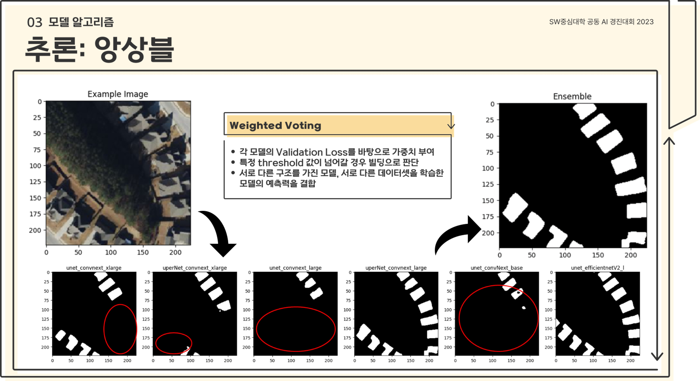

# Satellite-Image-Building-Area-Segmentation

We used it for the [2023 AI Innovation Challenge](https://dacon.io/competitions/official/236092/overview/description).

The main goal of the competition was to make a segmentation model for satellite building image.

We've placed 2nd placed on the competition and got 최우수상 award.

### Presentation Slides

